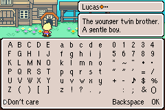

Updated: Sept. 21, 2022

This is a brief overview of the parts I'll be using for input in our game engine. It's taken some time to research everything, and I've even already tried some things out only to find there are better ways to do it. Hopefully you'll find this info useful.

## Configurable input

This is perhaps the most important feature. Always provide the ability to make your input configurable. There could be any number of reasons why players want to reconfigure the keys/buttons: Left-handed or one-handed players may want something entirely different, players could prefer ESDF instead of WASD, players might want to invert the Y-axis flight-stick controls, or any other number of reasons.

## Keyboard input

Keyboard input is probably the most complex of all types of input, because we want to support more than just QWERTY keyboards. If you only need to support QWERTY, then this will be overkill for you, but then again, with a little knowledge of how things work, it's not hard to cater to other languages/keyboards and will make the majority of the world that much more happy when they start playing your game without having to configure anything on top of the defaults.

### Position-based keys

Most games rely on the position of keys (WASD is a very common example for movement). The problem is there are many different keyboard layouts, and the WASD keys could be laid out differently. For example, on [AZERTY](https://en.wikipedia.org/wiki/AZERTY), the coresponding key positions are ZQSD. When playing a game, a lot of times AZERTY users will press the `ALT-Shift` key combo in Windows to switch the software layout to QWERTY (or they'll frustratingly roll their eyes when the Z or Q keys do something unexpected.) Obviously, it would be a pain and unrealistic to figure out what keyboard layout the player has and adjust your keys for them.

Fortunately, there's a way to specify keys by their position. They're called `scancodes`.

### Scancodes

Without going into too much detail, scancodes have a few different layouts themselves, called `scancode sets`. Just know that Windows always maps to `scancode set 1`. Other operating systems may use other sets, so if you need a good reference on the scancode key mappings, the chromium developers have already done this work for you. You can view their key/scancode mappings for the major operation systems in the file: [/ui/events/keycodes/dom/dom_code_data.inc](https://chromium.googlesource.com/chromium/src/+/lkgr/ui/events/keycodes/dom/dom_code_data.inc)

So for example, the key at the same position as the `w` key of a QWERTY keyboard in Windows will always have a scancode value of  `0x0011`, even if it is a different character on another keyboard layout. The same key position on AZERTY is the `z` key, but still has the same scancode value of `0x0011`.

For scancodes, for each key, the keyboard driver sends a separate code for the key-press event, called a `make code` , and a separate code for the key-release event, called a `break code`. The Windows APIs give us the make code, along with a separate way to tell if it was a key-press or key-release, so you don't have to keep track of the addtional break codes.

How do you get the scancode (technically the "make code") value? There are a couple ways in Windows. You can either use [Windows KEYDOWN/UP Messages](https://docs.microsoft.com/en-us/windows/win32/inputdev/keyboard-input) and/or the [Raw Input API](https://docs.microsoft.com/en-us/windows/win32/inputdev/raw-input). The Raw Input API has one advantage: it can distinguish between multiple of the same device type (multiple keyboards, multiple mice, etc). This probably won't be necessary for your use-case though, so you might be fine just sticking with using Windows Messages. Keep in mind you can use both APIs together just fine, if you need to. Here's a post with [more details and sample code](https://handmade.network/forums/t/2011-keyboard_inputs_-_scancodes,_raw_input,_text_input,_key_names).

### Text input

Say you want to support a chat box in your game. Text input from the keyboard should be treated differently than looking at scancodes or KEYDOWN/UP messages. A single Unicode character outside of the English language can consist of up to 4 bytes of data, and in order for users to input the text, they most likely will need to type multiple keys to enter a single character in their language (sometimes using an [IME](https://en.wikipedia.org/wiki/Input_method)). For this reason, you should probably use WM_CHAR messages, not scancodes nor KEYDOWN/UP messages, because WM_CHAR messages have already undergone some [translation](https://docs.microsoft.com/en-us/windows/win32/api/winuser/nf-winuser-translatemessage) for you. If you're building your game for unicode, WM_CHAR will be UTF-16LE, and support [surrogate-pairs](https://en.wikipedia.org/wiki/Universal_Character_Set_characters#Surrogates). Some unicode characters (AKA `code points`) will send 2 WM_CHAR messages to make up the entire character (via a surrogate-pair).

Related:  
[WM_CHAR documentation](https://docs.microsoft.com/en-us/windows/win32/inputdev/wm-char)  
[Sample code to handle multiple WM_CHAR messages per character (surrogate pairs)](https://handmade.network/forums/t/2011-keyboard_inputs_-_scancodes,_raw_input,_text_input,_key_names)

### Graphical input

In some cases, you may want to support one language, or a subset of languages, for text entry using a bitmap font, such as this from Mother 3:

## Mouse input

There are basically two types of mouse input: Unaltered high resolution input, and data that's been altered by an algorithm called `Pointer Ballistics`.

Pointer Ballistics are what Windows users expect to feel when moving their mouse with a visible cursor. It allows the mouse to accellerate (or decelerate) movement of the cursor on the screen based on how fast you physically move your mouse, mouse resolution and screen resolution. Since this is what users expect to feel, Pointer Ballistics are important when displaying a cursor. This can be accomplished by using [WM_MOUSEMOVE messages](https://docs.microsoft.com/en-us/windows/win32/inputdev/wm-mousemove), in which you receive coordinates with the Pointer Ballistics already applied. If you're still curious, you can read about the Windows [Pointer Ballistics algorithm](http://web.archive.org/web/20101222190833/http://www.microsoft.com:80/whdc/archive/pointer-bal.mspx).

The Raw Input API can be used to get unaltered high resolution mouse input, without Pointer Ballistics, but it has the advantage of using the full resolution of modern mice. This is preferred when you need more accuracy and you're not displaying a cursor, like in an FPS game. WM_MOUSEMOVE messages only fire on each "pixel", so they don't take advantage of high resolution mice.

## Gamepad input

I'll be using two main APIs: [Raw Input API](https://learn.microsoft.com/en-us/windows/win32/inputdev/raw-input) and [XInput](https://learn.microsoft.com/en-us/windows/win32/xinput/programming-guide). Basically, I want to be able to support a wide range of popular gamepads: Xbox, PlayStation, Nintendo Switch, 8BitDo, HID-compliant.

### Xbox controllers

The current way to support Xbox controllers is through the XInput API. XInput makes it super simple. There's a function to get current state of the controller, and another to set the speed of the two force feedback motors. There are also functions to work with a conntected headset, but I won't be supporting that for my engine.

While Xbox controllers are the only "official" supported controllers for XInput, a lot of gamepad/controller venders write drivers for their devices to work with XInput. Therefore, it makes sense to support XInput devices to get a wider range of controller support, instead of all the extra work it might take to get them all working individually via the Raw Input API (assuming they are HID compliant in the first place.) You can sort-of think of using XInput as a "catch-all" on Windows.

The only drawbacks of XInput are:
1) There's no way for software using XInput to tell if you really are using an Xbox controller or something else, so in-game diagrams will show an Xbox controller even though you might be connected with a DualShock 3 or 8BitDo controller or something else.
2) You're limited to 4 XInput controllers connected to the same PC (which is usually not a problem.)

As for differences between Xbox controllers:
* Xbox Series X controller adds a Share button.
* (Anything else?)

### PlayStation controllers

#### DualShock 3 (PS3)

*TL;DR: Support XInput in your game, then DualShock 3 can be made to work via XInput.*

Per [pcgameingwiki.com](https://www.pcgamingwiki.com/wiki/Controller:DualShock_3) the DualShock 3 "has non-standard HID descriptors and broken Bluetooth protocol that require specific drivers fixes to be used."
Unfortunately, you can't just connect the DualShock 3 via USB or Bluetooth and have it work out of the box with Windows 10/11.

Here is a nice driver that makes your PS3 controllers visible to the XInput API:  
[DsHidMini](https://vigem.org/projects/DsHidMini/) for Win10/11.  
They even explain the issue with bluetooth, which is basically that it can't accept the Raw Input API Output Reports (AKA Raw Input API packets sent to the controller) at a rate fast enough that Windows might send to it (so their driver has logic to rate-limit that.)

Of course, the drawback is the user has to install the driver, and since XInput is only meant for Xbox controllers, this means PS3 controllers will show up as a Xbox controllers under XInput, because there won't be any way to tell they are actually PS3 controllers. But this is an easier way to support DualShock 3 controllers without having to worry about coding/packaging your own driver.

#### DualShock 4 (PS4)

DualShock 4 fixed the HID and Bluetooth issues that the DualShock 3 has, so you can just connect it via USB or Bluetooth, and it will "just work" with the Raw Input API.
A detailed technical explanation can be found on [github](https://github.com/MysteriousJ/Joystick-Input-Examples#dualshock-4) along with sample Raw Input code.

This [RawInputViewer](https://github.com/EsportToys/RawInputViewer) (on github) can give clues about which Raw Input bytes/bits correspond to buttons pressed on the controller if you didn't have documentation in the github link above.

You could alternatively leave it up to another XInput mapper driver if you didn't want to deal with the Raw Input API. (I'm assuming they exist.) I personally prefer the Raw Input API, since it's not hard to get working, and it's a much better for a controller to "just work out-of-the-box".

#### DualSense (PS5)

DualSense continues to work out of the box with HID.
See [example Input Reports](https://github.com/nondebug/dualsense#input-reports) and their byte/bit mappings for both USB and Bluetooth connections. The byte/bit locations are a little different from DualShock 4, so you can't directly reuse the same code, but they're very similar.

Note that there might be a few different product IDs available now.
From "Revision IDs" [here](https://playstationdev.wiki/ps5devwiki/index.php/DualSense):

I hate the idea of hardcoding these. What if there's a new one available?
...or hopefully these are `RID_DEVICE_INFO_HID.dwVersionNumber` !!! Check it!!!!
`0x0CE6` is a productID, but hopefully productID is ALWAYS `0x0CE6`!

0x0CE6 => ModelType.BOND, 
0x0CE7 => ModelType.ASTON, 
0x0D5A => ModelType.LOTUS,

[Additional DualSense technical info](https://controllers.fandom.com/wiki/Sony_DualSense)

### 8BitDo controllers

[8BitDo](https://8bitdo.com) controllers can be put into XInput or DirectInput mode. Since I'll be using XInput to support Xbox controllers, there might not be anything extra I need to do to support 8BitDo controllers. Not exactly sure though, since I don't have one myself (yet).

#### Nintendo Switch Joy Cons / Pro

(TODO: research)
https://github.com/JibbSmart/JoyShockLibrary

[Tons of info and examples for Windows (github)](https://github.com/MysteriousJ/Joystick-Input-Examples)

## More to come

I still have a long way to go on implementing this, but I've done a good chunk of the leg-work. I'll update this page as I go.
